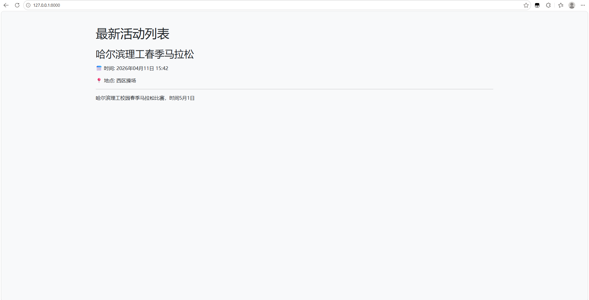
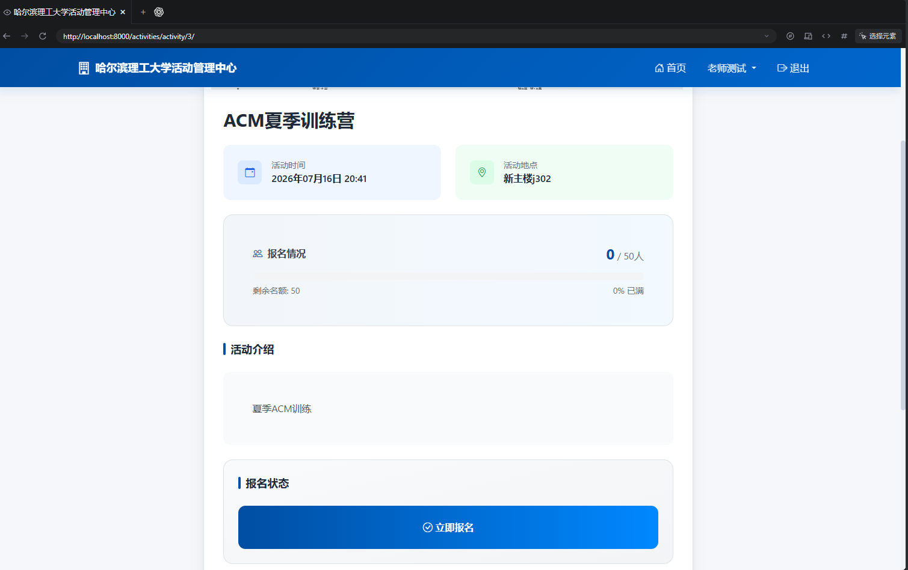
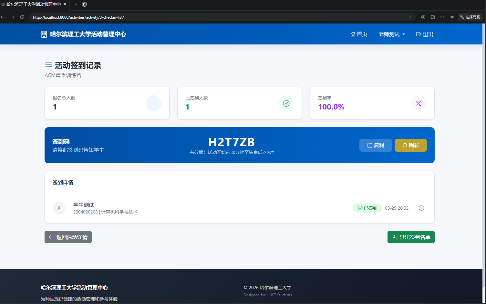
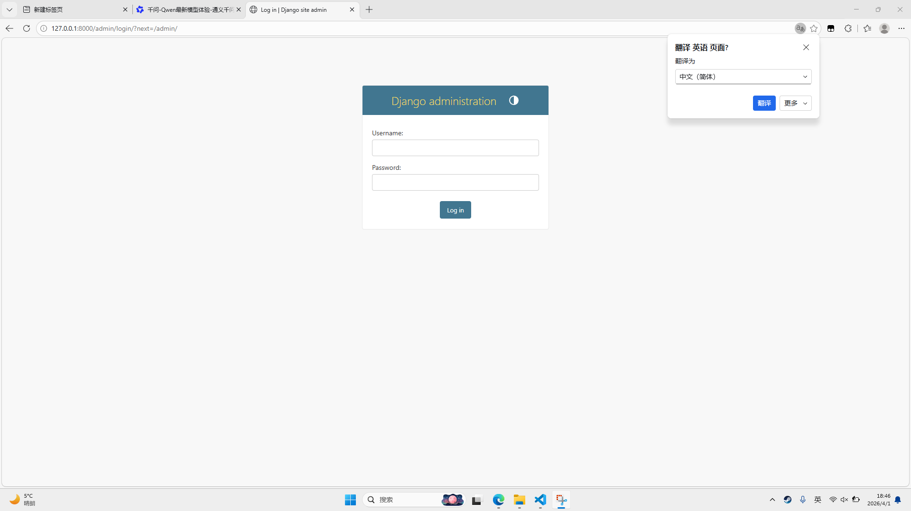

# 校园活动管理中心

基于 Django 的全栈校园活动管理平台，覆盖活动发布、在线报名、动态签到、数据审计与导出的完整业务闭环。项目重点不只是 CRUD，还包含 RBAC、并发报名控制、自动化测试与持续集成。

详细设计参见 [系统设计文档](docs/architecture.md)。

## 技术栈

| 层级 | 技术 |
|------|------|
| **后端** | Python 3.x / Django 6.0 |
| **数据库** | SQLite（本地开发）/ PostgreSQL（部署） |
| **前端** | Bootstrap 5 + Tailwind CSS + Bootstrap Icons |
| **认证** | Django Auth + django-simple-captcha 图形验证码 |

## 功能特性

- 🔐 **三级角色权限** — 学生（报名/签到）/ 活动老师（创建/管理活动）/ 开发者（全权限）
- 📅 **活动全生命周期** — 草稿 → 已发布 → 进行中 → 已结束
- ✍️ **并发安全报名** — 事务 + 行级锁 + 联合唯一约束，处理满额与重复请求
- ✅ **动态签到码** — 6 位随机码 + 时间窗口控制（活动前 30 分钟至结束后 2 小时）
- 📊 **签到管理** — 签到数据可视化 + CSV 一键导出（UTF-8 BOM，兼容 Excel）
- 🛡️ **安全防护** — 注册/登录图形验证码 + CSRF 保护 + 服务器端表单校验
- 📝 **审计日志** — 签到/取消操作自动记录结构化 JSON 日志（IP + User-Agent + 时间戳）
- 🧪 **质量保障** — 16 个自动化测试覆盖核心业务，并通过 GitHub Actions 持续集成
- 📱 **响应式设计** — 基于 Bootstrap 栅格系统，适配手机/平板/桌面端

## 快速开始

```bash
# 1. 克隆项目
git clone <your-repo-url>
cd campus-activity-management

# 2. 安装依赖
pip install -r requirements.txt

# 3. 配置环境变量（可选，开发环境可使用默认值）
cp .env.example .env

# 4. 数据库迁移
python manage.py migrate

# 5. 运行自动化测试
python manage.py test -v 2

# 6. 创建超级管理员
python manage.py createsuperuser

# 7. 启动服务
python manage.py runserver
```

访问 http://127.0.0.1:8000 即可使用。

## 项目结构

```
├── core/                  # Django 项目配置
│   ├── settings.py        # 全局配置（数据库/静态文件/国际化）
│   ├── urls.py            # 根路由（admin/auth/activities/captcha）
│   └── wsgi.py / asgi.py  # 部署入口
├── activities/            # 核心业务应用
│   ├── models.py          # 数据模型（Profile / Activity / Registration）
│   ├── views.py           # 视图逻辑（18 个端点）
│   ├── forms.py           # 表单（注册/登录/资料/活动，含 captcha）
│   ├── urls.py            # 应用路由
│   ├── signals.py         # Django 信号（User 创建时自动生成 Profile）
│   ├── tests.py           # 核心业务自动化测试
│   └── templatetags/      # 自定义模板标签（进度条百分比计算）
├── templates/             # Django 模板
│   ├── base.html          # 基础布局（导航栏 + 页脚 + 消息提示）
│   ├── activity_list.html # 活动列表（Hero 横幅 + 统计卡片 + 活动网格）
│   ├── activity_detail.html # 活动详情（报名/签到入口）
│   ├── checkin.html       # 学生签到页
│   ├── checkin_list.html  # 老师签到管理（统计 + 详情 + CSV 导出）
│   └── registration/      # 认证模板（注册/登录/资料编辑）
├── requirements.txt       # Python 依赖
├── .env.example           # 环境变量模板
├── .github/workflows/     # GitHub Actions 持续集成
├── docs/                  # 架构说明与项目截图
└── manage.py              # Django 命令行入口
```

## 数据模型

```
User (Django Auth)
  └── Profile (1:1)
        ├── role: student / teacher / developer
        ├── student_id, name, college, class_name, phone
        └── is_completed: 资料完整性标记

Activity
  ├── title, description, date, location, image, capacity
  ├── status: draft / published / ongoing / ended
  ├── creator → User (FK)
  ├── checkin_code, checkin_start_time, checkin_end_time
  └── Registration (FK, related_name='registrations')

Registration
  ├── user → User (FK), activity → Activity (FK)
  ├── unique_together: (user, activity)
  ├── is_checked_in, checked_in_at
  └── checkin_log: JSON 格式操作审计日志
```

## 设计亮点

- **RBAC 权限模型** — 基于 Django Auth + Profile.role 实现三级权限，通过 `@user_passes_test` + 自定义装饰器 `@profile_complete_required` 实现声明式权限校验
- **并发与幂等** — 在事务中对活动行加锁，并以用户和活动联合唯一约束兜底，防止超额和重复报名（行级锁需 PostgreSQL）
- **签到审计日志** — 每次签到/取消操作写入 JSONField，记录时间戳、IP、User-Agent 和操作类型，支持事后追溯
- **时间窗口控制** — 默认在活动开始前 30 分钟至结束后 2 小时开放，也支持为活动配置自定义窗口
- **数据安全** — 使用密码哈希、CSRF 保护、图形验证码、仅 POST 写接口和服务端表单校验
- **自动化质量门禁** — 16 个测试覆盖关键业务，CI 自动执行迁移检查、Django 系统检查和完整测试

## 工程文档

- [系统架构与设计决策](docs/architecture.md)

## 截图

| 首页 | 活动详情 |
|------|---------|
|  |  |

| 签到管理 | 管理后台 |
|---------|---------|
|  |  |
