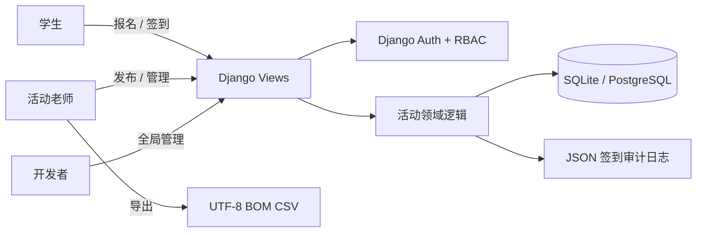
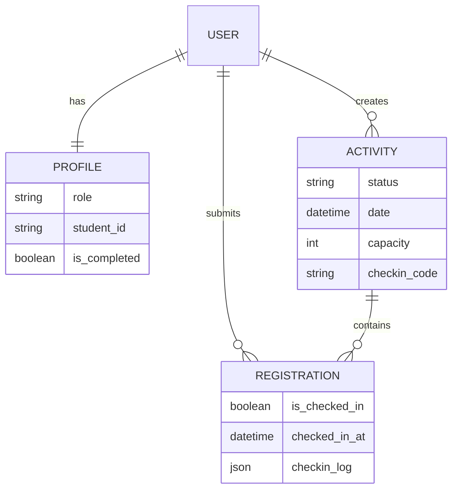

# 系统设计说明

## 业务架构



## 核心数据关系



## 关键设计决策

- 权限：使用 `Profile.role` 建模学生、活动老师、开发者三级角色；敏感操作同时校验角色和资源所有权。
- 并发报名：报名逻辑置于数据库事务中，并通过 `select_for_update()` 锁定活动记录。生产环境使用 PostgreSQL 时可串行化同一活动的报名请求，避免“先判断、后写入”导致超额。
- 幂等约束：`Registration(user, activity)` 设置联合唯一约束，重复请求不会产生多条报名记录。
- 签到安全：使用 `secrets` 生成 6 位签到码，支持自定义时间窗；签到和撤销均记录时间、IP、User-Agent 与动作类型。
- 写操作保护：报名、取消、签到码轮换等状态变更接口只接受 POST，并启用 Django CSRF 防护。
- 数据导出：CSV 使用 UTF-8 BOM，确保中文内容可直接由 Excel 正确打开。

## 测试策略

当前自动化测试覆盖 16 个核心场景：模型行为、签到时间窗、审计日志、重复及满额报名、草稿活动越权访问、角色权限、资源所有权、HTTP 方法限制和 CSV 导出。

运行：

```bash
python manage.py test -v 2
```
